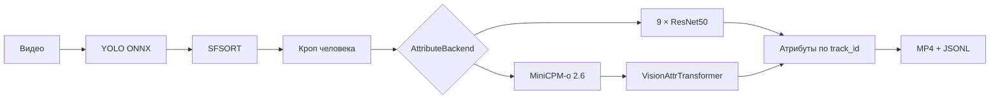

# Human Attributes Detector

Учебный проект для анализа людей на видео: YOLO обнаруживает человека, SFSORT сохраняет его
`track_id`, а выбранный backend определяет визуальные атрибуты. Результат — размеченное MP4 и
JSONL с покадровыми данными.

## Архитектура



Модели атрибутов реализуют один интерфейс:

```python
class AttributeBackend:
    def predict(self, image: PIL.Image.Image) -> dict[str, str]: ...
```

Backend загружается один раз. Все видео используют один ограниченный worker классификации, поэтому
несколько задач не создают несколько копий MiniCPM в VRAM.

## Что изменено в версии 2.0

- удалены IDE-файлы, логи, сгенерированная HTML-документация и старый монолитный API;
- оставлен один реально используемый трекер — SFSORT;
- старый ResNet и новый MiniCPM + Transformer подключаются через общий интерфейс;
- исправлен CPU-путь ResNet и добавлен явный выбор CPU/CUDA для PyTorch и ONNX Runtime;
- NMS стал class-aware, координаты кропа ограничиваются размером кадра;
- обычное окончание видео считается успешным завершением;
- MiniCPM работает из локального snapshot и не обращается к Hub во время инференса;
- checkpoint загружается с `weights_only=True`;
- API использует случайные имена файлов, лимиты размера/длительности/разрешения и API key;
- Telegram-бот стал тонким клиентом API, без токена в исходниках и общих файлов результатов;
- исправлена схема embeddings, padding mask и group-aware train/validation split;
- добавлены тесты, Ruff, `pip-audit` и CI.

## Ветки

Разработку этой версии следует начинать от `main` в новой ветке:

```bash
git switch main
git pull --ff-only
git switch -c refactor/unified
```

Не сливайте старые `bot` и `minicpmo` целиком. В них остаются опубликованный секрет, абсолютные пути,
несогласованные training scripts и сломанный gitlink. Полезная логика уже перенесена в эту версию.

## Требования

- Python 3.11 или 3.12;
- FFmpeg в `PATH` (рекомендуется даже при использовании OpenCV);
- Git submodules;
- для GPU: совместимые NVIDIA driver, CUDA runtime и cuDNN;
- веса моделей, которых нет в Git.

Клонирование:

```bash
git clone --recurse-submodules https://github.com/stasesonchik/Silhouette_Detector.git
cd Silhouette_Detector
```

Если репозиторий уже клонирован:

```bash
git submodule update --init --recursive
```

### Установка на CPU

```bash
python -m venv .venv
source .venv/bin/activate        # Windows: .venv\Scripts\activate
python -m pip install --upgrade pip
pip install -r requirements/cpu.txt
```

На CPU поддерживаются YOLO ONNX и ResNet. Полноточная MiniCPM-o 2.6 теоретически может работать на
CPU, но требует очень много RAM и практически не подходит для этого пайплайна.

### Установка на NVIDIA GPU

Для обычного GPU backend установите PyTorch и зависимости проекта:

```bash
pip install torch==2.8.0 torchvision==0.23.0 --index-url https://download.pytorch.org/whl/cu128
pip install -r requirements/gpu.txt
```

Для полноточной MiniCPM дополнительно:

```bash
pip install -r requirements/minicpm.txt
```

MiniCPM-o 2.6 INT4 требует специальную ветку AutoGPTQ и Transformers 4.44.2. На Windows
полная установка в отдельное окружение выполняется из PowerShell одной командой:

```powershell
.\scripts\setup_minicpm_int4_windows.ps1
```

Скрипт устанавливает PyTorch 2.8.0 + CUDA 12.8, фиксированные MiniCPM-зависимости, клонирует
проверенный commit ветки `minicpmo`, исправляет устаревшие CUDA-вызовы и собирает расширения.
Требуются Python 3.11, CUDA Toolkit 12.8 и Visual Studio 2022 Build Tools с C++ workload.

Не устанавливайте одновременно `onnxruntime` и `onnxruntime-gpu` в одно окружение.

## Веса

| Артефакт | Переменная | Путь по умолчанию |
|---|---|---|
| YOLO ONNX | `HAD_DETECTOR_MODEL` | `models/yolo.onnx` |
| ResNet ensemble | `HAD_RESNET_CHECKPOINT` | `models/resnet_attributes.pt` |
| VisionAttrTransformer | `HAD_TRANSFORMER_CHECKPOINT` | `models/vision_attr_transformer.pt` |
| MiniCPM snapshot | `HAD_MINICPM_MODEL_DIR` | `models/minicpm-o-2_6` |

Старые имена, которые стоит искать на исходном компьютере:

- `yolov8s_576x1024_v2.onnx`;
- `resnet_ens_11.19_e60_s0.782.pt`;
- `best_checkpoint.pt`;
- `MiniCPM-o 2.6int4 weights.pt`.

Последние два имени относятся к одному checkpoint вашего `VisionAttrTransformer`, а не к весам
самой MiniCPM.

### Локальный MiniCPM

Модель скачивается один раз. Команда разрешает `main` в конкретный commit SHA, сохраняет snapshot
локально и записывает SHA-256 всех Python-файлов модели:

```bash
had-download-minicpm \
  --repo-id openbmb/MiniCPM-o-2_6-int4 \
  --revision main \
  --destination models/minicpm-o-2_6-int4
```

После этого runtime использует только `local_files_only=True`. Для полностью воспроизводимой
установки укажите вместо `main` SHA из созданного `model-manifest.json`.

MiniCPM-o 4.5 является более новой omni-моделью, а MiniCPM-V 4.6 — более новой и заметно меньшей
vision-моделью. Они **не являются drop-in заменой**: размер и распределение визуальных embeddings
изменились, поэтому старый `VisionAttrTransformer` нужно переобучить. До появления датасета и нового
checkpoint проект намеренно сохраняет MiniCPM-o 2.6. Официальные источники:
<https://github.com/OpenBMB/MiniCPM-V> и <https://huggingface.co/openbmb/MiniCPM-o-4_5>.

## Конфигурация

Скопируйте пример и задайте собственный длинный API key:

```bash
cp .env.example .env
```

Файл `.env` не читается автоматически и не коммитится. Передайте переменные через оболочку,
Docker `--env-file` или менеджер секретов.

Основные значения:

```bash
export HAD_ATTRIBUTE_BACKEND=resnet   # resnet | minicpm | none
export HAD_DEVICE=auto                # auto | cpu | cuda | cuda:0
export HAD_API_KEY='replace-with-at-least-24-random-characters'
```

Если `HAD_API_KEY` не задан, API принимает запросы только с loopback-адреса. Для сетевого доступа
ключ обязателен.

## Запуск API

```bash
./run.sh
```

Создание задачи:

```bash
curl -X POST http://127.0.0.1:8000/api/v1/jobs \
  -H "X-API-Key: $HAD_API_KEY" \
  -F "file=@video.mp4"
```

Статус и результат:

```bash
curl -H "X-API-Key: $HAD_API_KEY" http://127.0.0.1:8000/api/v1/jobs/JOB_ID
curl -o result.mp4 -H "X-API-Key: $HAD_API_KEY" \
  http://127.0.0.1:8000/api/v1/jobs/JOB_ID/result
```

После скачивания результат можно удалить с сервера:

```bash
curl -X DELETE -H "X-API-Key: $HAD_API_KEY" \
  http://127.0.0.1:8000/api/v1/jobs/JOB_ID
```

API не принимает произвольные URL. Это намеренно исключает SSRF и случайный доступ к локальным
камерам/метаданным облачной машины.

## Telegram-бот

```bash
export TELEGRAM_BOT_TOKEN='token-from-BotFather'
export HAD_API_BASE='http://127.0.0.1:8000'
export HAD_API_KEY='the-same-api-key'
had-bot
```

Старый Telegram-токен из Git-истории необходимо отозвать через BotFather. Удаление файла из нового
commit не аннулирует ранее опубликованный токен.

## Обучение Transformer

Датасет в репозитории отсутствует. Создайте manifest следующего формата (полный пример находится в
`examples/dataset_manifest.example.json`):

```json
[
  {
    "image": "/data/person_001/frame_001.jpg",
    "group_id": "person_001",
    "labels": {
      "пол": "мужчина",
      "возраст": "17-35 лет"
    }
  }
]
```

`group_id` должен обозначать человека или исходное видео. Все кадры одной группы попадают только в
train или только в validation.

```bash
had-extract-embeddings dataset.json embeddings/ \
  --model-dir models/minicpm-o-2_6-int4 --device cuda

had-train-transformer embeddings/ models/vision_attr_transformer.pt --device cuda
```

Сохранённый embedding имеет форму `[N, P, D]`, а batch — `[B, N, P, D]`. Маска строится до padding,
поэтому примеры разной длины корректно объединяются.

## Проверки

```bash
pip install -r requirements/dev.txt
ruff check .
python -m compileall -q src tests
python -m unittest discover -s tests -v
pip-audit
```

Тесты CPU/GPU проверяют выбор устройства и провайдера без необходимости иметь CUDA в CI.
Полноценный smoke test требует реальные YOLO и attribute checkpoints; эти файлы в Git отсутствуют.

## Структура

```text
src/silhouette_detector/
├── app.py                 # безопасный API и bounded job manager
├── detection.py           # YOLO ONNX
├── tracking.py            # единственный tracker adapter
├── pipeline.py            # видео и покадровый pipeline
├── attribute_service.py   # одна модель и одна очередь
├── attributes/
│   ├── base.py            # общий интерфейс
│   ├── resnet.py          # старый backend
│   ├── minicpm.py         # локальный MiniCPM + Transformer
│   └── transformer.py     # обучаемая голова
└── training/              # embeddings и group-aware обучение
```

## Ограничения воспроизводимости

В исходной Git-истории нет весов YOLO, ResNet, Transformer, датасета или сохранённых метрик. Код и
тесты проверяют интерфейсы и корректность CPU/GPU-ветвей, но качество и скорость можно подтвердить
только после восстановления этих артефактов.
