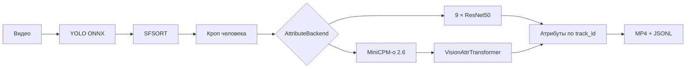

# Human Attributes Detector

Учебный проект для анализа людей на видео: YOLO обнаруживает человека, SFSORT сохраняет его
`track_id`, а выбранный backend определяет визуальные атрибуты. Результат — размеченное MP4 и
JSONL с покадровыми данными.

## Архитектура



Модели атрибутов реализуют один интерфейс:

```python
class AttributeBackend:
    def predict(self, image: PIL.Image.Image) -> dict[str, str]: ...
```

Backend загружается один раз. Все видео используют один ограниченный worker классификации, поэтому
несколько задач не создают несколько копий MiniCPM в VRAM.

## Что изменено в версии 2.0

- удалены IDE-файлы, логи, сгенерированная HTML-документация и старый монолитный API;
- оставлен один реально используемый трекер — SFSORT;
- старый ResNet и новый MiniCPM + Transformer подключаются через общий интерфейс;
- исправлен CPU-путь ResNet и добавлен явный выбор CPU/CUDA для PyTorch и ONNX Runtime;
- NMS стал class-aware, координаты кропа ограничиваются размером кадра;
- обычное окончание видео считается успешным завершением;
- MiniCPM работает из локального snapshot и не обращается к Hub во время инференса;
- checkpoint загружается с `weights_only=True`;
- API использует случайные имена файлов, лимиты размера/длительности/разрешения и API key;
- Telegram-бот стал тонким клиентом API, без токена в исходниках и общих файлов результатов;
- исправлена схема embeddings, padding mask и group-aware train/validation split;
- добавлены тесты, Ruff, `pip-audit` и CI.

## Ветки

Текущая стабилизация MiniCPM и воспроизводимого окружения ведётся в ветке
`detector-remaster`. Перед воспроизведением сохраните точный commit проекта:

```bash
git rev-parse HEAD
git status --short --branch
```

Специальный AutoGPTQ не является веткой этого репозитория: установочный скрипт клонирует его в
`.deps/AutoGPTQ-minicpmo` и проверяет отдельный commit.

## Проверенный Windows baseline

Полные CPU- и CUDA-проходы проверены 2–3 августа 2026 года. CPU-профиль использует
`YOLO ONNX → SFSORT → ResNet`, CUDA-профиль —
`YOLO ONNX → SFSORT → MiniCPM INT4 → VisionAttrTransformer`.

| Компонент | Зафиксированное значение |
|---|---|
| Windows | `Windows-10-10.0.26200-SP0` |
| Python | `3.11.9` |
| PyTorch | `2.8.0+cu128` |
| torchvision / torchaudio | `0.23.0+cu128` / `2.8.0+cu128` |
| CUDA в PyTorch / Toolkit | `12.8` / `12.8` |
| nvcc / cuDNN | `12.8.61` / `91002` |
| GPU | NVIDIA GeForce RTX 4060 Ti, `16379.375 MiB` VRAM |
| NVIDIA driver | `591.86` |
| ONNX Runtime CPU / CUDA | `onnxruntime==1.28.0` / `onnxruntime-gpu==1.26.0` |
| Transformers | `4.44.2` |
| AutoGPTQ | `0.8.0.dev0+cu121`, исходники пересобраны локально под PyTorch/CUDA baseline |
| MiniCPM | `openbmb/MiniCPM-o-2_6-int4` revision `f347c848dd57a5dfdf5b6e32eb257101a6a8a07f` |

Единый машиночитаемый источник этих значений —
[`reproducibility/windows-cuda-baseline.json`](reproducibility/windows-cuda-baseline.json).
Полные списки зависимостей сохранены в двух файлах: 40 точных CPU-пакетов в
[`windows-cpu-py311.lock.txt`](requirements/locks/windows-cpu-py311.lock.txt) и 101 CUDA-пакет в
[`windows-cuda-py311.lock.txt`](requirements/locks/windows-cuda-py311.lock.txt). Локальные
editable-установки проекта и AutoGPTQ намеренно не включены: их версии определяются Git commit.

SHA256 в baseline нужен скриптам, чтобы автоматически отличить правильные веса и snapshot от
другого файла с тем же именем. При обычной установке копировать или вводить хеши вручную не нужно.

## Подтверждённые результаты

Оба видеотеста использовали один тестовый MP4: 33 обрабатываемых кадра, `854×478`, `5 FPS`, два
track ID. Время `video job` включает полный HTTP-проход от загрузки до готовых MP4 и JSONL.

| Профиль | Backend атрибутов | Фактический YOLO provider | Video job | Кадры | Детекции | С атрибутами | Результат |
|---|---|---|---:|---:|---:|---:|---|
| Windows CPU | ResNet | `CPUExecutionProvider` | `14.094 s` | 33 | 66 | 66 | PASS |
| Windows CUDA | MiniCPM + Transformer | `CUDAExecutionProvider` | `28.250 s` | 33 | 66 | 66 | PASS |

Эти строки подтверждают воспроизводимость двух разных backends, но не являются честным сравнением
скорости CPU и GPU: ResNet и MiniCPM решают этап атрибутов разными моделями.

Отдельный CUDA-анализ MiniCPM + Transformer на RTX 4060 Ti:

| Замер | Значение |
|---|---:|
| Загрузка backend | `18.133 s` |
| Первый полный inference | `1.596 s` |
| Среднее из 5 прогретых inference | `779.276 ms` |
| Диапазон прогретых inference | `770.285–787.100 ms` |
| Peak allocated VRAM | `9274.949 MiB` |
| Рост live allocated VRAM после 5 повторов | `0 MiB` |

Все исходные числа также записаны в
[`reproducibility/windows-cuda-baseline.json`](reproducibility/windows-cuda-baseline.json).

## Требования

- для проверенного Windows baseline: 64-bit Python `3.11.9`;
- FFmpeg в `PATH` (рекомендуется даже при использовании OpenCV);
- Git submodules;
- для MiniCPM INT4: CUDA Toolkit `12.8`, совместимый NVIDIA driver и Visual Studio 2022 Build
  Tools с workload **Desktop development with C++**;
- веса моделей, которых нет в Git.

Клонирование:

```bash
git clone --recurse-submodules https://github.com/Nek1tt/Human_Attributes_Detector.git
cd Human_Attributes_Detector
```

Если репозиторий уже клонирован:

```bash
git submodule update --init --recursive
```

### Windows: CPU (YOLO ONNX + ResNet)

Положите собственное короткое видео в игнорируемый Git каталог `test-data/`, а YOLO и ResNet — в
`models/`. Затем установите проверенный CPU lock:

```powershell
.\scripts\setup_cpu_windows.ps1
```

Скрипт требует именно Python `3.11.9`. Отдельный ResNet-видеотест:

```powershell
.\scripts\run_resnet_video_test.ps1 `
  -Video "test-data\person.mp4" `
  -Yolo "models\yolov8s_576x1024_v2.onnx" `
  -ResNetCheckpoint "models\resnet_ens_11.19_e60_s0.782.pt"
```

Полная проверка воспроизводимости выполняется одной командой. Она создаёт два новых окружения:
bootstrap для формирования CPU lock и второе чистое окружение, устанавливаемое только из lock.
Во втором окружении выполняются unit-тесты и полный видеопроход YOLO → SFSORT → ResNet → MP4 +
JSONL:

```powershell
.\scripts\verify_clean_cpu_install.ps1 `
  -Video "test-data\person.mp4" `
  -Yolo "models\yolov8s_576x1024_v2.onnx" `
  -ResNetCheckpoint "models\resnet_ens_11.19_e60_s0.782.pt"
```

Команда создаёт два временных окружения, повторно экспортирует CPU lock и проверяет, что он
совпадает с зафиксированным. Отчёты появляются в `var\cpu-clean-validation-*`. Веса, test-data,
snapshot, venv и секреты в Git и validation bundle не включаются.

На CPU поддерживаются YOLO ONNX, SFSORT и ResNet. Проверенный MiniCPM INT4 использует GPTQ и
AutoGPTQ, поэтому требует CUDA.

### Windows: NVIDIA CUDA + MiniCPM INT4

В корне репозитория выполните:

```powershell
.\scripts\setup_minicpm_int4_windows.ps1
```

Скрипт:

- создаёт `.venv-minicpm-torch280` на Python `3.11.9`;
- устанавливает `torch`, `torchvision` и `torchaudio` для CUDA `12.8`;
- устанавливает `onnxruntime-gpu==1.26.0`, совместимый с CUDA 12.8 и cuDNN 9;
- устанавливает проверенные зависимости remote code MiniCPM;
- клонирует `https://github.com/RanchiZhao/AutoGPTQ.git`;
- checkout commit `a9c8109ef450793e3d890c76a36f22177fcbbe28`;
- применяет проверенный патч 16 устаревших CUDA-вызовов и собирает расширения;
- запускает импорт всех зависимостей, проверку версий и `pip check`.

Экспортировать CUDA lock нужно только после намеренного изменения зависимостей:

```powershell
.\scripts\export_windows_lock.ps1 -Target cuda
```

Обычная установка уже использует зафиксированный lock автоматически. После установки проверьте точные
версии и CUDA-расширения:

```powershell
.\scripts\verify_minicpm_env.ps1
```

Подготовьте локальный snapshot exact revision и запустите полный CUDA-видеотест:

```powershell
$MiniCPMDir = "C:\Users\USERNAME\.cache\huggingface\hub\models--openbmb--MiniCPM-o-2_6-int4\snapshots\f347c848dd57a5dfdf5b6e32eb257101a6a8a07f"

.\scripts\prepare_minicpm_snapshot.ps1 -MiniCPMModelDir $MiniCPMDir

.\scripts\run_minicpm_video_test.ps1 `
  -Video "test-data\person.mp4" `
  -Yolo "models\yolov8s_576x1024_v2.onnx" `
  -MiniCPMModelDir $MiniCPMDir `
  -TransformerCheckpoint "models\MiniCPM-o 2.6int4 weights.pt"
```

Не устанавливайте одновременно `onnxruntime` и `onnxruntime-gpu` в одно окружение.

## Веса

| Артефакт | Переменная | Путь по умолчанию |
|---|---|---|
| YOLO ONNX | `HAD_DETECTOR_MODEL` | `models/yolo.onnx` |
| ResNet ensemble | `HAD_RESNET_CHECKPOINT` | `models/resnet_attributes.pt` |
| VisionAttrTransformer | `HAD_TRANSFORMER_CHECKPOINT` | `models/vision_attr_transformer.pt` |
| MiniCPM snapshot | `HAD_MINICPM_MODEL_DIR` | `models/minicpm-o-2_6` |

Старые имена, которые стоит искать на исходном компьютере:

- `yolov8s_576x1024_v2.onnx`;
- `resnet_ens_11.19_e60_s0.782.pt`;
- `best_checkpoint.pt`;
- `MiniCPM-o 2.6int4 weights.pt`.

Последние два имени относятся к одному checkpoint вашего `VisionAttrTransformer`, а не к весам
самой MiniCPM.

Проверенный YOLO checkpoint:

- размер: `44805580` bytes;
- SHA256: `c0d4889317191548e8c18a31b4b91f8d2b28842102eebe4523f9f1593a9ea933`;
- вход ONNX: `1024×576`.

Проверенный Transformer checkpoint:

- размер: `585660899` bytes;
- SHA256: `099510a29497162f9afbab9cad1b5092fe246d70869bb90bd7b6e2ed2b6affe2`;
- архитектура: `input_dim=3584`, `hidden_dim=768`, `num_layers=6`, `num_heads=12`;
- девять attribute heads: `3, 6, 7, 13, 13, 8, 4, 3, 3` классов.

Checkpoint не хранится в Git. Для полного воспроизведения его нужно получить отдельно и положить в
`models/`; validation-скрипт сам сверит SHA256 перед загрузкой.

Проверенный ResNet checkpoint:

- размер: `943757326` bytes;
- SHA256: `0c0ae02e9a5990c6adbd1ac1d2ca0e6a88c21091b87ee7de621115b328447a91`.

### Локальный MiniCPM

Для уже загруженного Hugging Face snapshot выполните:

```powershell
.\scripts\prepare_minicpm_snapshot.ps1 `
  -MiniCPMModelDir "C:\Users\USERNAME\.cache\huggingface\hub\models--openbmb--MiniCPM-o-2_6-int4\snapshots\f347c848dd57a5dfdf5b6e32eb257101a6a8a07f"
```

Для скачивания exact revision в новый каталог добавьте `-Download`:

```powershell
.\scripts\prepare_minicpm_snapshot.ps1 `
  -MiniCPMModelDir "models\minicpm-o-2_6-int4" `
  -Download
```

Скрипт никогда не использует `main`: он скачивает revision
`f347c848dd57a5dfdf5b6e32eb257101a6a8a07f`, применяет зафиксированное исправление отсутствующего
`typing.List` в `resampler.py`, записывает `model-manifest.json` и сверяет SHA256 всех восьми
Python-файлов remote code с baseline. После этого `HAD_ALLOW_UNVERIFIED_MODEL_CODE` не нужен.
Runtime использует `local_files_only=True` и при каждой загрузке повторно сверяет manifest.

MiniCPM-o 4.5 является более новой omni-моделью, а MiniCPM-V 4.6 — более новой и заметно меньшей
vision-моделью. Они **не являются drop-in заменой**: размер и распределение визуальных embeddings
изменились, поэтому старый `VisionAttrTransformer` нужно переобучить. До появления датасета и нового
checkpoint проект намеренно сохраняет MiniCPM-o 2.6. Официальные источники:
<https://github.com/OpenBMB/MiniCPM-V> и <https://huggingface.co/openbmb/MiniCPM-o-4_5>.

## Сбор полного отчёта об окружении

После подготовки snapshot и checkpoint выполните одну команду:

```powershell
.\scripts\capture_reproducibility.ps1 `
  -MiniCPMModelDir "C:\Users\USERNAME\.cache\huggingface\hub\models--openbmb--MiniCPM-o-2_6-int4\snapshots\f347c848dd57a5dfdf5b6e32eb257101a6a8a07f" `
  -TransformerCheckpoint "models\MiniCPM-o 2.6int4 weights.pt" `
  -ResNetCheckpoint "models\resnet_ens_11.19_e60_s0.782.pt"
```

В `var\reproducibility-YYYYMMDD-HHMMSS\` появятся:

| Файл | Содержимое |
|---|---|
| `environment-report.json` | Python, все packages, PyTorch/CUDA/cuDNN, GPU/VRAM/driver, `nvcc`, Git, AutoGPTQ, модели, Docker bases и baseline checks |
| `pip-freeze.txt` | исходный полный `pip freeze --all`, включая сведения об editable installs |
| `requirements-lock-candidate.txt` | переносимый кандидат lock без editable проекта и AutoGPTQ |

По умолчанию команда завершается ошибкой при любом отличии от baseline. Чтобы только собрать отчёт
из другого окружения, используйте `-AllowBaselineDifferences`.

Отдельный подробный CUDA-анализ с одной загрузкой backend и пятью inference:

```powershell
.\scripts\run_minicpm_transformer_analysis.ps1 `
  -MiniCPMModelDir $MiniCPMDir `
  -TransformerCheckpoint $TransformerCheckpoint `
  -InputImage "test-data\example1.jpg" `
  -Repeats 5
```

После создания проверенного `model-manifest.json` флаг `-AllowUnverifiedModelCode` здесь не нужен.

Полный MiniCPM-видеотест через тот же HTTP pipeline:

```powershell
.\scripts\run_minicpm_video_test.ps1 `
  -Video "test-data\person.mp4" `
  -Yolo "models\yolov8s_576x1024_v2.onnx" `
  -MiniCPMModelDir $MiniCPMDir `
  -TransformerCheckpoint "models\MiniCPM-o 2.6int4 weights.pt"
```

Скрипт использует `.venv-minicpm-torch280`, `cuda` и проверенный локальный manifest по
умолчанию. Он проверяет реальный MP4, наличие детекций и track ID, все девять API-ключей,
допустимость русских меток и наличие рассчитанных атрибутов в JSONL. Результаты и готовый ZIP
появляются в `var\video-tests\*-minicpm`.

## Docker

Base images закреплены одновременно tag и multi-platform digest:

| Файл | Base image |
|---|---|
| `Dockerfile` | `python:3.11.9-slim-bookworm@sha256:8fb099...c60c317` |
| `Dockerfile.gpu` | `nvidia/cuda:12.8.1-cudnn-runtime-ubuntu24.04@sha256:ac55d1...1eb34bc` |

```bash
docker build -t human-attributes-detector:cpu -f Dockerfile .
docker build -t human-attributes-detector:gpu -f Dockerfile.gpu .
```

Оба Dockerfile используют те же прямые зависимости, что и локальная установка. На данном этапе
подтверждены Windows CPU и Windows CUDA; Docker CPU/GPU ещё предстоит собрать и проверить.
Текущий `Dockerfile.gpu` покрывает CUDA-путь ONNX/ResNet, но пока не собирает специальный AutoGPTQ
для MiniCPM INT4.

## Конфигурация

Скопируйте пример и задайте собственный длинный API key:

```bash
cp .env.example .env
```

Файл `.env` не читается автоматически и не коммитится. Передайте переменные через оболочку,
Docker `--env-file` или менеджер секретов.

Основные значения:

```bash
export HAD_ATTRIBUTE_BACKEND=resnet   # resnet | minicpm | none
export HAD_DEVICE=auto                # auto | cpu | cuda | cuda:0
export HAD_API_KEY='replace-with-at-least-24-random-characters'
```

Если `HAD_API_KEY` не задан, API принимает запросы только с loopback-адреса. Для сетевого доступа
ключ обязателен.

## Запуск API

```bash
./run.sh
```

Создание задачи:

```bash
curl -X POST http://127.0.0.1:8000/api/v1/jobs \
  -H "X-API-Key: $HAD_API_KEY" \
  -F "file=@video.mp4"
```

Статус и результат:

```bash
curl -H "X-API-Key: $HAD_API_KEY" http://127.0.0.1:8000/api/v1/jobs/JOB_ID
curl -o result.mp4 -H "X-API-Key: $HAD_API_KEY" \
  http://127.0.0.1:8000/api/v1/jobs/JOB_ID/result
```

После скачивания результат можно удалить с сервера:

```bash
curl -X DELETE -H "X-API-Key: $HAD_API_KEY" \
  http://127.0.0.1:8000/api/v1/jobs/JOB_ID
```

API не принимает произвольные URL. Это намеренно исключает SSRF и случайный доступ к локальным
камерам/метаданным облачной машины.

## Telegram-бот

```bash
export TELEGRAM_BOT_TOKEN='token-from-BotFather'
export HAD_API_BASE='http://127.0.0.1:8000'
export HAD_API_KEY='the-same-api-key'
had-bot
```

Старый Telegram-токен из Git-истории необходимо отозвать через BotFather. Удаление файла из нового
commit не аннулирует ранее опубликованный токен.

## Обучение Transformer

Датасет в репозитории отсутствует. Создайте manifest следующего формата (полный пример находится в
`examples/dataset_manifest.example.json`):

```json
[
  {
    "image": "/data/person_001/frame_001.jpg",
    "group_id": "person_001",
    "labels": {
      "пол": "мужчина",
      "возраст": "17-35 лет"
    }
  }
]
```

`group_id` должен обозначать человека или исходное видео. Все кадры одной группы попадают только в
train или только в validation.

```bash
had-extract-embeddings dataset.json embeddings/ \
  --model-dir models/minicpm-o-2_6-int4 --device cuda

had-train-transformer embeddings/ models/vision_attr_transformer.pt --device cuda
```

Сохранённый embedding имеет форму `[N, P, D]`, а batch — `[B, N, P, D]`. Маска строится до padding,
поэтому примеры разной длины корректно объединяются.

## Проверки

```bash
pip install -r requirements/dev.txt
ruff check .
python -m compileall -q src tests scripts
python -m unittest discover -s tests -v
pip-audit
```

Тесты CPU/GPU проверяют выбор устройства и провайдера без необходимости иметь CUDA в CI.
Полноценный smoke test требует реальные YOLO и attribute checkpoints; эти файлы в Git отсутствуют.

## Структура

```text
src/silhouette_detector/
├── app.py                 # безопасный API и bounded job manager
├── detection.py           # YOLO ONNX
├── tracking.py            # единственный tracker adapter
├── pipeline.py            # видео и покадровый pipeline
├── attribute_service.py   # одна модель и одна очередь
├── attributes/
│   ├── base.py            # общий интерфейс
│   ├── resnet.py          # старый backend
│   ├── minicpm.py         # локальный MiniCPM + Transformer
│   └── transformer.py     # обучаемая голова
└── training/              # embeddings и group-aware обучение
```

## Ограничения воспроизводимости

В исходной Git-истории нет весов YOLO, ResNet, Transformer, датасета или сохранённых метрик. Код и
тесты проверяют интерфейсы и корректность CPU/GPU-ветвей, но качество и скорость можно подтвердить
только после восстановления этих артефактов.
